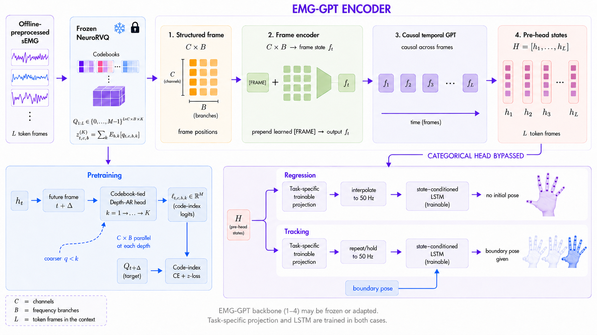

<div align="center">

# EMG-GPT

**Predictive Pretraining on Residual-Quantized EMG Tokens for Hand Pose Estimation**

[Paper](https://arxiv.org/abs/2610.05235) · [Weights](https://huggingface.co/ettoremagni/EMG-GPT) · [Inference guide](docs/inference.md) · [Citation](#citation)

[Ettore Magni](https://www.linkedin.com/in/ettoremagni) · [Rolandos Alexandros Potamias](https://rolpotamias.github.io/) · [Stefanos Zafeiriou](https://profiles.imperial.ac.uk/s.zafeiriou) · [Konstantinos Barmpas](https://www.barmpas.com/)

</div>



Offline hand-pose inference from 16-channel EMG using a frozen
[NeuroRVQ](https://github.com/KonstantinosBarmpas/NeuroRVQ) tokenizer, an adapted
causal GPT and a state-conditioned pose decoder. Inference follows the figure's
two pose paths with fixed weights; the pretraining head is bypassed.
This repository contains inference code only. The selected GPT checkpoints were
pretrained with CUDA on an NVIDIA GH200 120 GB GPU; inference accepts CPU or CUDA.

## Paper results

EMG-GPT test results from [Tables 1 and 3](https://arxiv.org/html/2610.05235v1)
for the checkpoints below.
Values are mean ± sample SD **across users**, not across training seeds; lower is better.

| Task | Held-out condition | Angular MAE (°) ↓ | Landmark error (mm) ↓ |
| --- | --- | ---: | ---: |
| Regression | User | 12.8 ± 1.1 | 16.3 ± 1.3 |
| Regression | Stage | 16.3 ± 1.6 | 22.0 ± 1.9 |
| Regression | User, Stage | 16.6 ± 1.3 | 22.7 ± 1.4 |
| Tracking | User | 8.9 ± 0.9 | 11.6 ± 1.2 |
| Tracking | Stage | 12.4 ± 1.4 | 16.9 ± 1.8 |
| Tracking | User, Stage | 12.2 ± 1.3 | 16.9 ± 1.4 |

Tracking uses a ground-truth boundary pose; Regression does not.
The inference API returns joint angles; landmark evaluation and training are outside this release.

## Comparison on the same test samples

Appendix E.2, [Table 4](https://arxiv.org/html/2610.05235v1#A5.T4), compares released
vEMG2Pose weights with EMG-GPT at the same ordered test target indices within
each task, using the same valid-value counts, metrics and equal-user aggregation.
Values are mean ± sample SD across users.

| Task | Held-out condition | Model | Angular MAE (°) ↓ | Landmark error (mm) ↓ |
| --- | --- | --- | ---: | ---: |
| Regression | User | vEMG2Pose | 12.80 ± 1.31 | 16.29 ± 1.85 |
| Regression | User | EMG-GPT | 12.80 ± 1.08 | 16.30 ± 1.29 |
| Regression | Stage | vEMG2Pose | 15.40 ± 1.59 | 20.43 ± 2.09 |
| Regression | Stage | EMG-GPT | 16.30 ± 1.57 | 22.02 ± 1.92 |
| Regression | User, Stage | vEMG2Pose | 15.73 ± 1.38 | 21.25 ± 1.79 |
| Regression | User, Stage | EMG-GPT | 16.64 ± 1.30 | 22.70 ± 1.39 |
| Tracking | User | vEMG2Pose | 8.57 ± 0.95 | 11.11 ± 1.35 |
| Tracking | User | EMG-GPT | 8.89 ± 0.93 | 11.59 ± 1.24 |
| Tracking | Stage | vEMG2Pose | 11.50 ± 1.41 | 15.45 ± 1.81 |
| Tracking | Stage | EMG-GPT | 12.42 ± 1.43 | 16.88 ± 1.80 |
| Tracking | User, Stage | vEMG2Pose | 11.33 ± 0.97 | 15.64 ± 1.33 |
| Tracking | User, Stage | EMG-GPT | 12.18 ± 1.25 | 16.93 ± 1.36 |

Each model retains its native frontend. This comparison uses the paper's matched
evaluation protocol; it does not reproduce the original vEMG2Pose benchmark.

## Checkpoints

The [Hugging Face repository](https://huggingface.co/ettoremagni/EMG-GPT) contains
two bundles, each with the **adapted GPT backbone and pose head together**:

| Bundle | GPT initialization | Selected pose checkpoint |
| --- | --- | --- |
| `regression/` | Step 280,000 | Pose warm-start → full fine-tuning, step 2,000 |
| `tracking/` | Step 400,000 | Pose warm-start → full fine-tuning, step 5,000 |

Each contains `config.json`, `model.safetensors`, `codebooks.safetensors` and
`manifest.json`. The shared NeuroRVQ EMG v1 tokenizer is downloaded separately
from its authors. Downloads use pinned revisions; the loader checks file hashes
against the [artifact catalog](src/emg_gpt/resources/artifacts.json).

## Install

Use Python 3.11 or newer (tested on 3.11–3.14):

```bash
git clone https://github.com/ettomagni/EMG-GPT.git
cd EMG-GPT
python3 -m venv .venv
source .venv/bin/activate
python -m pip install '.[download]'
```

For NVIDIA GPU inference, install a CUDA-enabled PyTorch build using the
[PyTorch installation guide](https://pytorch.org/get-started/locally/), then use
`--device cuda`. The example below uses `--device cpu` so it also runs without a
GPU. MPS is unsupported. Add the `data` extra (`pip install '.[data]'`) to read
official emg2pose HDF5 recordings. No hand model or meshes are needed.

## Regression quick start

Download the Regression bundle and tokenizer, then predict from your raw EMG
file `recording.npz` (format below). For a runnable synthetic example, see the
[smoke check](docs/inference.md#smoke-check).

```bash
hf download ettoremagni/EMG-GPT \
  --revision 812d159b4e7a4fb1c95da865f4f1e2635fa6522f \
  --include "regression/*" --include "LICENSE" --local-dir weights
emg-gpt-download-tokenizer --output weights/NeuroRVQ_EMG_tokenizer_v1.pt
emg-gpt-predict \
  --model-dir weights/regression \
  --tokenizer weights/NeuroRVQ_EMG_tokenizer_v1.pt \
  --input recording.npz --output prediction.npz --device cpu
```

For Tracking, replace `regression/*` with `tracking/*` and keep `LICENSE` included.
Supply one measured boundary pose per window, or an all-NaN row to skip it;
see [Tracking input](docs/inference.md#tracking-input).

Input NPZ files must contain `emg` (finite real array `[samples,16]`),
`sampling_rate_hz` (scalar `2000`) and `channel_names` (Unicode strings `c1` through
`c16`, in the supplied array's order). Preserve the native emg2pose amplitude scale;
the API does not normalize it. Other sensors/scales are not validated.

Official emg2pose HDF5 recordings can be passed directly with the `data` extra.
Only EMG and timestamps are read. Datasets are not bundled; see the
[emg2pose source and data terms](https://github.com/facebookresearch/emg2pose).
For a synthetic input, the Python API and output fields, use the
[inference guide](docs/inference.md).

## Protocol and output

The frontend filters the whole 2-kHz recording at 20–399.5 Hz, resamples to
1 kHz and tokenizes independent 200-sample patches every 40 samples. Zero-phase
filtering makes this an **offline** pipeline; supply the complete raw recording.

Predictions are `[windows,250,20]` joint angles in radians at 50 Hz. A full window
needs at least 13,119 raw samples. Timestamps and a coverage mask identify warm-up,
inter-window gaps and the unscored tail. Tracking requires explicit boundary poses;
target poses are never read automatically. See the guide for exact alignment.

## Citation

```bibtex
@misc{magni2026emggpt,
  title={EMG-GPT: Predictive Pretraining on Residual-Quantized EMG Tokens for Hand Pose Estimation},
  author={Ettore Magni and Rolandos Alexandros Potamias and Stefanos Zafeiriou and Konstantinos Barmpas},
  year={2026},
  eprint={2610.05235},
  archivePrefix={arXiv},
  primaryClass={cs.LG},
  url={https://arxiv.org/abs/2610.05235}
}
```

Machine-readable metadata: [CITATION.cff](CITATION.cff).

## License

EMG-GPT model weights (`model.safetensors`):
[CC BY-NC-SA 4.0](https://huggingface.co/ettoremagni/EMG-GPT/blob/main/LICENSE).
Inference code: [CC BY-NC 4.0](LICENSE).

The [NeuroRVQ](https://github.com/KonstantinosBarmpas/NeuroRVQ) tokenizer and
`codebooks.safetensors` retain their upstream CC BY-NC 4.0 terms. Retained code
components and their licenses are listed in [third-party notices](THIRD_PARTY_NOTICES.md).
